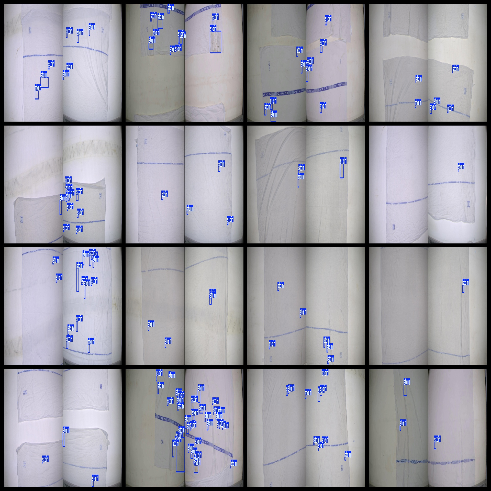

# Bed Sheet Stains Detection Dataset 3935 imagesVOC+YOLO format

The bed sheet stains detection dataset consists of 3935 images, organized in VOC+YOLO format.

The dataset is available in three folders within a ZIP file: JPEGImages, Annotations, and labels. The JPEGImages folder contains 3935 JPG images, the Annotations folder contains 3935 XML files, and the labels folder contains 3935 txt files. There are a total of 1 label category with the name "stain".

For each label category, there are 26766 instances (frames) labeled as "stain". The total number of frames is 26766.

The images are all clear, with a resolution of pixels. The images have not been enhanced.

The repository where this dataset can be found is at datasets_sl.

The shapes of the labels are rectangle boxes, used for target detection recognition.

This dataset does not provide any guarantees regarding the accuracy or precision of the models trained on it. It only provides accurate and reasonable annotations.

The annotations and images are as follows:

## Images

---

Here is a pay link on Stripe (https://buy.stripe.com/3cs8yP7sY87d0vu9AB). Please contact me lonlonago@foxmail.com after funding $89, and I will send you a complete data files, thank you!

